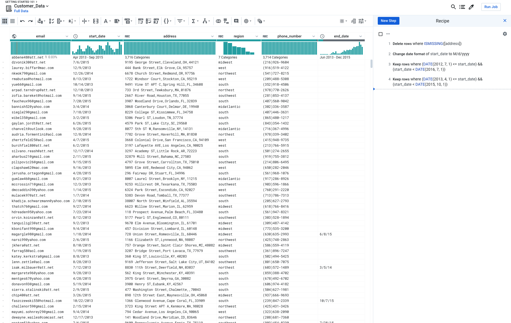

# A3: Play with Extraction

In this assignment, you will try out interfaces for data and text extraction.  Trifacta Wrangler is an interface that employs a programming-by-example interaction modality.    

Datasets:

1. [2013films.txt](/files/hdisys/2013films.txt):  A dataset of all the movies in 2013 from January to March. It contains Movie name, Production house, Genre, Publisher and other details.

## Wrangler: text extraction

Access [Trifacta for students from their website](https://www.trifacta.com/start-wrangling/).  

Some tips using Wrangler:

* Check out the introduction [video](https://vimeo.com/19185801) to get a feel of how wrangler works.
* You may wanna start off by loading ~50 lines of data instead of the entire files and play around with the tool.
* Wrangler responds to mouse highlights and clicks on the displayed table cells by suggesting operations on the left sidebar.  
* Hovering over each element shows the result in the table view.  
* Clicking adds the operation.  
* Clear the sidebar by clicking the colored row above the schema row.

#### Your Task

Load the 2013films dataset into Wrangler, and then use the tool to generate output as follows, i.e., Movie name, Production/Distribution house, Director, Genre and publisher. 

	A dark truth, Magnolia Pictures, Damian Lee, Action,ComingSoon.net
	Table No. 21, Eros International, Aditya Datt, Thriller, BoxOfficeMojo.com
	[...more rows...]

For the purpose of explanation columns are separated by `||`. You can choose any pattern to extract information. 

1. Movie name can be identified as first column in every line formatted as ``[[ <movie name> ]]`` 
1. Production/Distribution house is the following column that is formatted as ``[[< Production house>]]``
1. Director name can be identified with `(director)` tag that follows the name. Just extracting one name near the tag would be enough.
1. Genre is present in the next column but make sure to extract only second part that is separated by the `|` operator. For eg. in `[Action film|Action]` relevant information is Action  
1. Publisher name can be identified in the last column with format `publisher=<publisher name>`
1. It may help to skip first few lines that contains html code, so that you process actual records.

#### Questions 

* Use wrangler to clean the data, then determine 
  * Which Production/Distribution house produced maximum movies.
  * What is the most popular genre.
* Share your experience with Trifacta. Which part of the cleaning procedure does it make easier? Which part is hard? Any comments on Trifacta, pros or cons or further improvements.

#### Notes

* Your wrangler script is not expected to be sophisticated enough to generate the results for the question asked. It just needs to clean/combine the data enough for you to observe the data and answer the question.

#### Files you need to submit

* _Recipe and Data_ You need to download the wrangler "recipe" (script) and "sample data as csv" as follows: The recipe is simply a text file with a sequence of transformations. And the sample is your final table. 
  * 
* _Screenshot and Short Answers in One pdf file_  You need to create a screenshot of your dashboard like below. Make sure the picture/pictures includes ALL your recipe steps. Then, insert your sceenshot in your pdf file and answer the question above.  
  * 

## Programming by Example

Synsh is a web application that synthesizes bash shell scripts that transform an input text file into an example output file.

https://synsh.dev/

Here is a reference page https://synsh.dev/about/. 

#### Task

1. Play with it and attach your example screenshot in your pdf file.

2. Which is it great at? Which is it bad at? Any improvements? 

   

# Submission Instructions

#### Read BEFORE Submitting

* You need to submit 3 files:
  * Recipe log(.wrangle)
  * Final data table(.csv)
  * Pdf File includes all question answers(.pdf)
* Zip these three files and name it "NAME_UNI_A3.zip"

#### Submission Link

https://www.dropbox.com/request/HerKJnYpm1satGNRyGz9