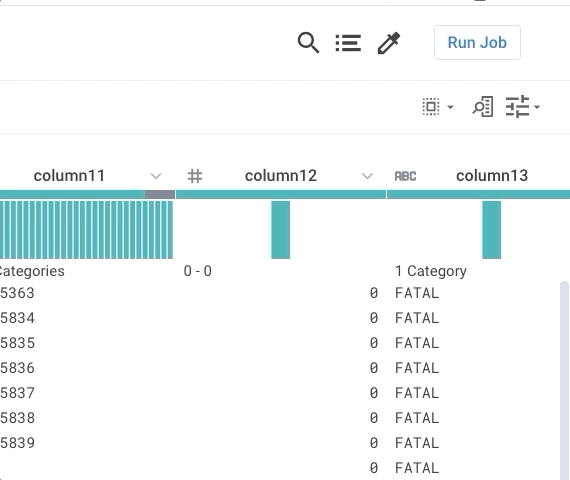

# A4: Play with Wrangling/Extraction

* Due: Nov 15 11:59PM (EST)
* Teams of 1 - 2 

IN FLUX

In this assignment, you will try out interfaces for data and text extraction.  

## Wrangler: data prep

Trifacta Wrangler is an interface that employs a programming-by-example interaction modality.    

Datasets:

[2013films.txt](/files/hdisys/2013films.txt):  A dataset of all the movies in 2013 from January to March. It contains Movie name, Production house, Genre, Publisher and other details.

Access [Trifacta for students from their website](https://www.trifacta.com/start-wrangling/).  

Some tips using Wrangler:

* Check out the introduction [video](https://vimeo.com/19185801) to get a feel of how wrangler works.
* You may wanna start off by loading ~50 lines of data instead of the entire files and play around with the tool.
* Wrangler responds to mouse highlights and clicks on the displayed table cells by suggesting operations on the left sidebar.  
* Hovering over each element shows the result in the table view.  
* Clicking adds the operation.  
* Clear the sidebar by clicking the colored row above the schema row.

#### Your Task

Load the 2013films dataset into Wrangler, and then use the tool to generate output as follows, i.e., Movie name, Production/Distribution house, Director, Genre and publisher. 

	A dark truth, Magnolia Pictures, Damian Lee, Action,ComingSoon.net
	Table No. 21, Eros International, Aditya Datt, Thriller, BoxOfficeMojo.com
	[...more rows...]

For the purpose of explanation columns are separated by `||`. You can choose any pattern to extract information. 

1. Movie name can be identified as first column in every line formatted as ``[[ <movie name> ]]`` 
1. Production/Distribution house is the following column that is formatted as ``[[< Production house>]]``
1. Director name can be identified with `(director)` tag that follows the name. Just extracting one name near the tag would be enough.
1. Genre is present in the next column but make sure to extract only second part that is separated by the `|` operator. For eg. in `[Action film|Action]` relevant information is Action  
1. Publisher name can be identified in the last column with format `publisher=<publisher name>`
1. It may help to skip first few lines that contains html code, so that you process actual records.

#### Questions 

* Use wrangler to clean the data, then determine 
  * Which Production/Distribution house produced maximum movies.
  * What is the most popular genre.
* Share your experience with Trifacta. Which part of the cleaning procedure does it make easier? Which part is hard? Any comments on Trifacta, pros or cons or further improvements.

#### Notes

* Your wrangler script is not expected to be sophisticated enough to generate the results for the question asked. It just needs to clean/combine the data enough for you to observe the data and answer the question.

#### Files you need to submit

* _Recipe and Data_ You need to download the wrangler "recipe" (script) and "sample data as csv" as follows: The recipe is simply a text file with a sequence of transformations. And the sample is your final table. 
  * 
* _Screenshot and Short Answers in One pdf file_  You need to create a screenshot of your dashboard like below. Make sure the picture/pictures includes ALL your recipe steps. Then, insert your sceenshot in your pdf file and answer the question above.  
  * 

## DBT: Extract-Load-Transform using SQL

We will be using the [Incarceration Trends](https://github.com/vera-institute/incarceration-trends) dataset collected by the Vera Institute.   We will be using the [county-level data file](https://github.com/vera-institute/incarceration_trends/blob/master/incarceration_trends.csv?raw=true). Open the [Codebook](https://github.com/vera-institute/incarceration_trends/blob/master/incarceration_trends-Codebook.pdf?raw=true). Starting from page 11, it describes the attributes in the dataset.  Notice how a lot of attributes are actually encoded in the attribute names.  For instance, aapi_pop_15to64 is a numeric value that stores the population count for Asian American/Pacific Islanders aged 15 to 64.  This should clearly be three separate attributes `population`, `ethnicity`, `age`.  The same is true for almost all of the measures.

You will use DBT to turn this dataset into a well-formed table.

* [Install dbt](https://docs.getdbt.com/dbt-cli/installation) or use their dbt cloud (you're on your own!)
* [DBT Tutorial](https://courses.getdbt.com/courses/fundamentals) (You will need to create an account for dbt)
* [Link for Snowflake](https://signup.snowflake.com/)

You can use any other DBT supported datawarehouse also like Redshift, BigQuery, Apache Spark, Databricks, etc. as per your preference.

This type of data, where lots of metadata is encoded in the attributes and described in a codebook, is incredibly common in public data repositories.  It's an open problem how to automatically/best transform these types of data into well-formed tables.

#### Questions

* What does DBT do well in solving this problem?  What limitations does it have?
* What does Wrangler do well in solving this problem?    What limitations does it have?
* What might be a human data interface design to aid this task?    Consider the language, the interface design, the interactions, the tasks.

#### Notes

* Note that the transformations you performed are called "second-order", because you are manipulating/querying the schema definitions as if they are data.   There's an awesome paper called [SchemaSQL](https://citeseerx.ist.psu.edu/viewdoc/download?doi=10.1.1.46.9541&rep=rep1&type=pdf) that defined a second order language for this type of stuff! 

# Submission Instructions

#### Read BEFORE Submitting

##### Section-1: Wrangler
* You need to submit 3 files:
  * Recipe log(.wrangle)
  * Final data table(.csv)
  * Pdf File includes all question answers, url and screenshots(.pdf)
* Zip all three files together with PROPER names to distinguish them and name the zipped file as "NAME_UNI_Wrangler_A4.zip"

##### Section-2: DBT
* You need to submit 3 files:
  * dbt file
  * Final data table(.csv)
  * Pdf File includes all question answers, url and screenshots(.pdf)
* Zip all three files together with PROPER names to distinguish them and name the zipped file as "NAME_UNI_DBT_A4.zip"

#### Submission Link

[Submit your responses here!](https://docs.google.com/forms/d/e/1FAIpQLScrivDyDWqH0Tmy_-JAP7_Y0fqp7RItP6f70V4gzCf64TwPdg/viewform?usp=sf_link)
