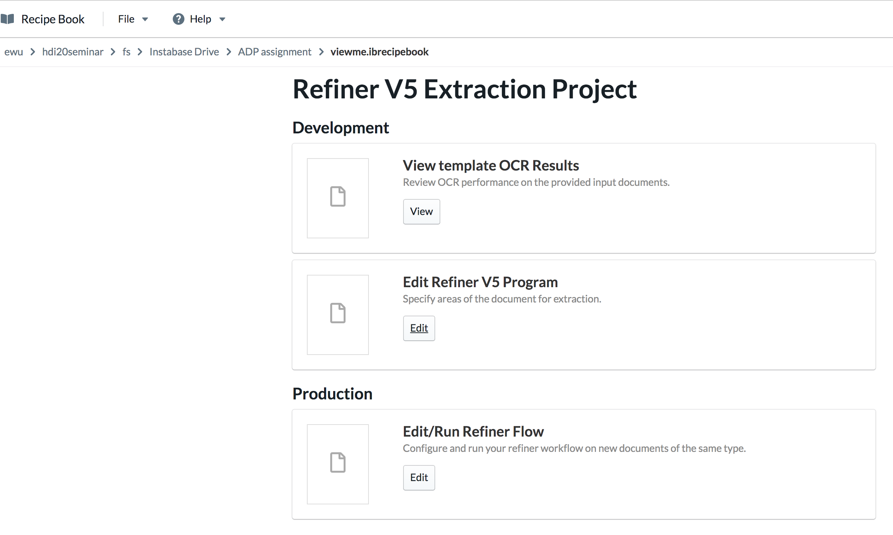
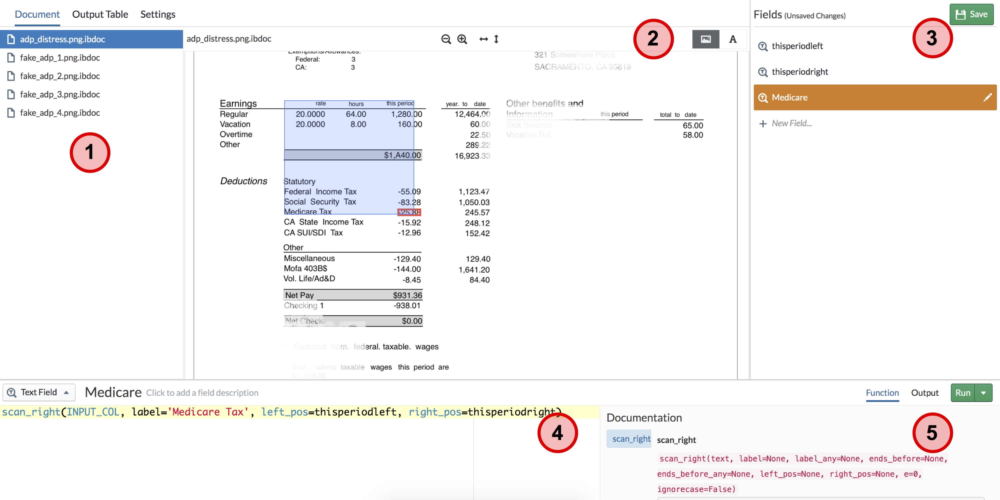

-
<!--
## Instabase: text extraction from PDF/images

This assignment will introduce you to another state of the art document extraction application called Refiner.  
It provides a visual-programming interface for writing and debugging document extraction programs.

As with the Draco assignment, the point is to get experience with another text extraction modality.
Do you best to form an opinion about what you like, and what would be great for future tools to solve.

**Refiner V5 is in beta.  So if you encounter a bug, click save and refresh the page.  Contact the staff if you hit issues that are hard to resolve**

#### Setup

First create an account on the instabase website below (note that this URL is special for this class).
The service is still in beta, so there are some weird hurdles, such as editing the url:

* Go to [https://www.instabase.com/account/register?use_token=true](https://www.instabase.com/account/register?use_token=true)
* USE THE FOLLOWING TOKEN IN ORDER TO REGISTER: `ewu-columbia-2020`
* Make sure you sign up with your `AB1235@columbia email`!!!
* If you did not register using the token, you can still enter the token at this login page: https://www.instabase.com/account/login?use_token=true

Create a workspace

* Click on the icon in the upper left, and go to workspaces. Choose _public_ workspace.   
* In the right, click New Workspace and name it whatever you want.

The tool we will be using is called Refiner 5, which is in beta.  You need to enable beta apps as followings:

* Once you are in your workspace, click on the icon in the upper left and then click "Apps".
  The url should end with `<your username>/<your workspace>/apps`
* Change `apps` in the url into `beta-apps`.  
* Now you will be able to use Refiner 5.

Now you will copy the assignment into your workspace

* go to [https://dogfood.instabase.com/ewu/hdi20seminar/fs/Instabase%20Drive/](https://dogfood.instabase.com/ewu/hdi20seminar/fs/Instabase%20Drive/)
* right click and copy `ADP assignment` and `Gusto assignment` into your account's workspace

#### Loading refiner

First, let's open refiner and extract data from the ADP paystubs

* Go to your account's workspace
* Click on `ADP assignment`.  The page should look like the following image
  * 
* **THIS IS THE KEY STEP**: edit the URL by replacing `www.instabase.com` with `dogfood.instabase.com`.
  This is needed to use the current version of Refiner.
* Click on `Edit` under `Edit Refiner V5 Program`.   You should see something like the following:

#### The Refiner Interface

Let's walk through the interface!  There are 5 main parts

1. This lists the documens we've loaded.  You can click `Output Table` to see all of your extracted fields as columns, and each document as row.
2. This shows the current document you are extracting.  
   * Refiner works by letting you define "anchors" which are fixed locations in the document that you can reference to extract nearby text.
     The blue and red boxes correspond to the "anchor" and the extracted text for the current field you are defining, respectively.
   * To the right of the red "2" circle, you can click on the "A" button to see the extracted OCR text.  
      Notice that its spacing is consistent with the document image.  
      This text is the variable `INPUT_COL` that you will write extraction programs from.
3. This panel lists the fields that you wish to extract.  As examples, we have defined three already.
   * `thisperiodleft` defines a field that looks for the first instance of the string `this period` and finds the left position of its bounding box.
   * `thisperiodright` finds the right position of the string's bounding box.
   * `Medicare` defines a field that looks for the string `Medicare Tax` as an anchor, and extracts all the text ot the right of the anchor
     that are between `thisperiodleft` and `thisperiodright`.  Thus it extracts `-25.88` rather than the entire row of text.
   * Note the "save" button in the right!  Refiner does NOT autosave, so you need to click it often :)
4. This is where you define the extraction function for a field.  For this assignment you will primarily use the following functions:
   * `scan_right`, `scan_below`, `left_pos`, `right_pos`
   * Functions can be nested within each other
5. This shows the documentation for the functions you are currently writing.  There are 3 useful tabs
   * "Function" shows the function documentation
   * "Output" shows the result of running the function on the current document
   * "Run": you need to click this before there is an output.  
     

There are two useful documentations to help you

* [A walkthrough of refiner](../files/hdisys/refiner-walkthrough.pdf) provides a mental model of how refiner works.  
* [API reference of refiner functions](https://dogfood.instabase.com/docs/reference/refiner/parsing-functions/).  There are a ton of refiner functions beyond the ones we mentioned above.

#### Your Task

Note: if you meet the issue that (XXX is not found in the table), click the arrow near `<Run>` button and use `<Run all>` instead.

##### ADP Assignment:

Write additional fields to extract the year-to-date federal income tax, the social security tax, and the net pay for each document.

##### Gusto Assignment:

Write fields to extract the 

* The current gross earnings from employee earnings table.
* The current guideline traditional 401(k) from employee deduction.
* The remaining paid time off balance from the paid time off policy.

##### Question:

* How this tool differs from the paper's? Any advantages or disadvantages?

* What features and reserach problems do you think would be useful in the future?

#### How to submit this task

For ADP and Gusto assignment, just paste your workspace link in your pdf file.  Also, write your answer to the questions in the pdf. 

Note: To find your workspace link, click on the icon in the upper left, then workspace. Choose your workspace containing the assignments and copy link from url bar. The link ends with `<your username>/<your workspace>` + "/fs/Instabase%20Drive/".  

--> 

<!--

## Programming by Example

Synsh is a web application that synthesizes bash shell scripts that transform an input text file into an example output file.

https://synsh.dev/

Here is a reference page https://synsh.dev/about/. 

#### Task

1. Play with it and attach your example screenshot in your pdf file.

2. Which is it great at? Which is it bad at? Any improvements? 
-->

--
layout: page_2020
---

# A3: Play with Extraction

Updates:

3/19: we extend the deadline to Apr 1 11:59PM 

Due: Apr 1 11:59PM (EST)

In this assignment, you will try out interfaces for data and text extraction.  

## Wrangler: text extraction

Trifacta Wrangler is an interface that employs a programming-by-example interaction modality.    

Datasets:

[2013films.txt](/files/hdisys/2013films.txt):  A dataset of all the movies in 2013 from January to March. It contains Movie name, Production house, Genre, Publisher and other details.

Access [Trifacta for students from their website](https://www.trifacta.com/start-wrangling/).  

Some tips using Wrangler:

* Check out the introduction [video](https://vimeo.com/19185801) to get a feel of how wrangler works.
* You may wanna start off by loading ~50 lines of data instead of the entire files and play around with the tool.
* Wrangler responds to mouse highlights and clicks on the displayed table cells by suggesting operations on the left sidebar.  
* Hovering over each element shows the result in the table view.  
* Clicking adds the operation.  
* Clear the sidebar by clicking the colored row above the schema row.

#### Your Task

Load the 2013films dataset into Wrangler, and then use the tool to generate output as follows, i.e., Movie name, Production/Distribution house, Director, Genre and publisher. 

	A dark truth, Magnolia Pictures, Damian Lee, Action,ComingSoon.net
	Table No. 21, Eros International, Aditya Datt, Thriller, BoxOfficeMojo.com
	[...more rows...]

For the purpose of explanation columns are separated by `||`. You can choose any pattern to extract information. 

1. Movie name can be identified as first column in every line formatted as ``[[ <movie name> ]]`` 
1. Production/Distribution house is the following column that is formatted as ``[[< Production house>]]``
1. Director name can be identified with `(director)` tag that follows the name. Just extracting one name near the tag would be enough.
1. Genre is present in the next column but make sure to extract only second part that is separated by the `|` operator. For eg. in `[Action film|Action]` relevant information is Action  
1. Publisher name can be identified in the last column with format `publisher=<publisher name>`
1. It may help to skip first few lines that contains html code, so that you process actual records.

#### Questions 

* Use wrangler to clean the data, then determine 
  * Which Production/Distribution house produced maximum movies.
  * What is the most popular genre.
* Share your experience with Trifacta. Which part of the cleaning procedure does it make easier? Which part is hard? Any comments on Trifacta, pros or cons or further improvements.

#### Notes

* Your wrangler script is not expected to be sophisticated enough to generate the results for the question asked. It just needs to clean/combine the data enough for you to observe the data and answer the question.

#### Files you need to submit

* _Recipe and Data_ You need to download the wrangler "recipe" (script) and "sample data as csv" as follows: The recipe is simply a text file with a sequence of transformations. And the sample is your final table. 
  * 
* _Screenshot and Short Answers in One pdf file_  You need to create a screenshot of your dashboard like below. Make sure the picture/pictures includes ALL your recipe steps. Then, insert your sceenshot in your pdf file and answer the question above.  
  * 

## Instabase: text extraction from PDF/images

This assignment will introduce you to another state of the art document extraction application called Refiner.  
It provides a visual-programming interface for writing and debugging document extraction programs.

As with the Draco assignment, the point is to get experience with another text extraction modality.
Do you best to form an opinion about what you like, and what would be great for future tools to solve.

**Refiner V5 is in beta.  So if you encounter a bug, click save and refresh the page.  Contact the staff if you hit issues that are hard to resolve**

#### Setup

First create an account on the instabase website below (note that this URL is special for this class).
The service is still in beta, so there are some weird hurdles, such as editing the url:

* Go to [https://www.instabase.com/account/register?use_token=true](https://www.instabase.com/account/register?use_token=true)
* USE THE FOLLOWING TOKEN IN ORDER TO REGISTER: `ewu-columbia-2020`
* Make sure you sign up with your `AB1235@columbia email`!!!
* If you did not register using the token, you can still enter the token at this login page: https://www.instabase.com/account/login?use_token=true

Create a workspace

* Click on the icon in the upper left, and go to workspaces. Choose _public_ workspace.   
* In the right, click New Workspace and name it whatever you want.

The tool we will be using is called Refiner 5, which is in beta.  You need to enable beta apps as followings:

* Once you are in your workspace, click on the icon in the upper left and then click "Apps".
  The url should end with `<your username>/<your workspace>/apps`
* Change `apps` in the url into `beta-apps`.  
* Now you will be able to use Refiner 5.

Now you will copy the assignment into your workspace

* go to [https://dogfood.instabase.com/ewu/hdi20seminar/fs/Instabase%20Drive/](https://dogfood.instabase.com/ewu/hdi20seminar/fs/Instabase%20Drive/)
* right click and copy `ADP assignment` and `Gusto assignment` into your account's workspace

#### Loading refiner

First, let's open refiner and extract data from the ADP paystubs

* Go to your account's workspace
* Click on `ADP assignment`.  The page should look like the following image
  * 
* **THIS IS THE KEY STEP**: edit the URL by replacing `www.instabase.com` with `dogfood.instabase.com`.
  This is needed to use the current version of Refiner.
* Click on `Edit` under `Edit Refiner V5 Program`.   You should see something like the following:

#### The Refiner Interface

Let's walk through the interface!  There are 5 main parts

1. This lists the documens we've loaded.  You can click `Output Table` to see all of your extracted fields as columns, and each document as row.
2. This shows the current document you are extracting.  
   * Refiner works by letting you define "anchors" which are fixed locations in the document that you can reference to extract nearby text.
     The blue and red boxes correspond to the "anchor" and the extracted text for the current field you are defining, respectively.
   * To the right of the red "2" circle, you can click on the "A" button to see the extracted OCR text.  
      Notice that its spacing is consistent with the document image.  
      This text is the variable `INPUT_COL` that you will write extraction programs from.
3. This panel lists the fields that you wish to extract.  As examples, we have defined three already.
   * `thisperiodleft` defines a field that looks for the first instance of the string `this period` and finds the left position of its bounding box.
   * `thisperiodright` finds the right position of the string's bounding box.
   * `Medicare` defines a field that looks for the string `Medicare Tax` as an anchor, and extracts all the text ot the right of the anchor
     that are between `thisperiodleft` and `thisperiodright`.  Thus it extracts `-25.88` rather than the entire row of text.
   * Note the "save" button in the right!  Refiner does NOT autosave, so you need to click it often :)
4. This is where you define the extraction function for a field.  For this assignment you will primarily use the following functions:
   * `scan_right`, `scan_below`, `left_pos`, `right_pos`
   * Functions can be nested within each other
5. This shows the documentation for the functions you are currently writing.  There are 3 useful tabs
   * "Function" shows the function documentation
   * "Output" shows the result of running the function on the current document
   * "Run": you need to click this before there is an output.  
     

There are two useful documentations to help you

* [A walkthrough of refiner](../files/hdisys/refiner-walkthrough.pdf) provides a mental model of how refiner works.  
* [API reference of refiner functions](https://dogfood.instabase.com/docs/reference/refiner/parsing-functions/).  There are a ton of refiner functions beyond the ones we mentioned above.

#### Your Task

Note: if you meet the issue that (XXX is not found in the table), click the arrow near `<Run>` button and use `<Run all>` instead.

##### ADP Assignment:

Write additional fields to extract the year-to-date federal income tax, the social security tax, and the net pay for each document.

##### Gusto Assignment:

Write fields to extract the 

* The current gross earnings from employee earnings table.
* The current guideline traditional 401(k) from employee deduction.
* The remaining paid time off balance from the paid time off policy.

##### Question:

* How this tool differs from the paper's? Any advantages or disadvantages?

* What features and reserach problems do you think would be useful in the future?

#### How to submit this task

For ADP and Gusto assignment, just paste your workspace link in your pdf file.  Also, write your answer to the questions in the pdf. 

Note: To find your workspace link, click on the icon in the upper left, then workspace. Choose your workspace containing the assignments and copy link from url bar. The link ends with `<your username>/<your workspace>` + "/fs/Instabase%20Drive/".  

<!--

## Programming by Example

Synsh is a web application that synthesizes bash shell scripts that transform an input text file into an example output file.

https://synsh.dev/

Here is a reference page https://synsh.dev/about/. 

#### Task

1. Play with it and attach your example screenshot in your pdf file.

2. Which is it great at? Which is it bad at? Any improvements? 
-->

# Submission Instructions

#### Read BEFORE Submitting

* You need to submit 3 files:
  * Recipe log(.wrangle)
  * Final data table(.csv)
  * Pdf File includes all question answers and url(.pdf)
* Zip these three files and name it "NAME_UNI_A3.zip"

#### Submission Link

[https://www.dropbox.com/request/HerKJnYpm1satGNRyGz9](https://www.dropbox.com/request/HerKJnYpm1satGNRyGz9)
